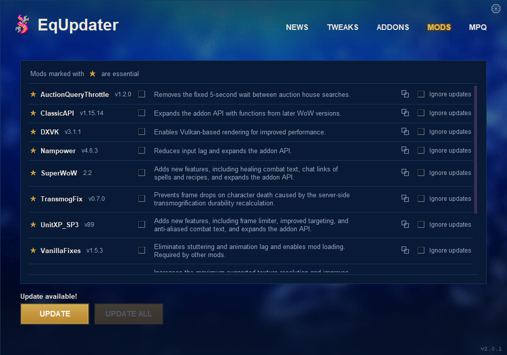

<p align="center">
  
</p>

<h1 align="center">EqUpdater</h1>

<p align="center">
  A desktop updater and mod manager for <b>OctoWoW</b>.<br>
  Game client, DLL mods, addons, texture packs, client tweaks and server news, in one place.
</p>

<p align="center">
  
</p>

> EqUpdater is derived from **[Octo Updater](https://github.com/rebasedkon/octo-updater)**
> by **rebasedkon**. Support the original author on
> [Ko-fi](https://ko-fi.com/rebased) or
> [Buy Me a Coffee](https://buymeacoffee.com/rebased).
> See [Credits](#credits).

---

## Install

Download the latest release from the
[**Releases page**](https://github.com/eqomdx/EqUpdater/releases/latest).
Nothing else is needed: no Python, no build tools.

### Windows

1. Download **`EqUpdater-vX.Y.Z-Windows.exe`**.
2. Run it. It installs EqUpdater to
   `%LOCALAPPDATA%\Programs\EqUpdater`, adds it to the Start menu (and,
   if you like, the desktop), and starts it.

No administrator rights are needed, and it never touches your game folder.

**Updating:** download the newer `EqUpdater-vX.Y.Z-Windows.exe` and run it
(close EqUpdater first). It replaces the app in that same place and points
every EqUpdater shortcut there. Your settings, managed mods and addons, and
backups live separately in `%LOCALAPPDATA%\EqUpdater` and are kept. If
anything goes wrong part-way, the version you had stays in place.

### Linux

1. Download **`EqUpdater-vX.Y.Z-Linux-x86_64.AppImage`**.
2. Make it executable and run it:

   ```sh
   chmod +x EqUpdater-vX.Y.Z-Linux-x86_64.AppImage
   ./EqUpdater-vX.Y.Z-Linux-x86_64.AppImage
   ```

EqUpdater runs natively on Linux (x86_64; Ubuntu 22.04 and newer, Mint,
Fedora, Arch and others). The AppImage carries everything it needs,
including the `aria2c` the client download uses. Settings live in
`~/.local/share/EqUpdater`. **Updating:** download the newer AppImage and
run that one instead.

The OctoWoW client itself is a Windows program, so **PLAY needs a way to
run Windows games: Wine, Proton or UMU.** By default EqUpdater uses `wine`
if it is installed, otherwise `umu-run`. To use anything else - a
particular Proton, Lutris, Faugus, a custom Wine prefix - open
**Settings → Game launcher**:

- **Launch command** - the command that starts the game. `{exe}` stands
  for the path of `WoW.exe` (or `VanillaFixes.exe`); without `{exe}` the
  path is added at the end. `{dir}` is the game folder. Examples:
  `wine`, `gamemoderun wine {exe}`, `umu-run`,
  `/path/to/proton run`.
- **Wine prefix** - passed as `WINEPREFIX`; leave it empty for the default.
- **Environment variables** - one `NAME=value` per line, for example
  `DXVK_HUD=fps` or `PROTON_LOG=1`. They are given to the game only, when
  PLAY starts it, and win over anything set above. The value is passed
  exactly as typed (spaces and `=` included; nothing is expanded or run).
  A line EqUpdater cannot use is pointed out straight away, and PLAY will
  not start the game until it is fixed.

The game runs on its own: closing EqUpdater never closes it. It gets your
desktop session as EqUpdater got it, without EqUpdater's own launch details
(the desktop's startup ID and the AppImage's variables), so its window is
its own in the taskbar. If a game started through Bottles or another
launcher still shows only in Alt+Tab, start the same command from a
terminal: if it behaves the same there, it is that launcher's or the
window manager's setting (for example a Wine virtual desktop), not
EqUpdater's.

Everything else - updates, mods, addons, texture packs, tweaks, the
`WoW.exe` patch - works the same as on Windows. Keep the game anywhere,
for example `~/Games/OctoWoW` or inside a Wine prefix.

---

## Safe by design

**EqUpdater only automatically updates what it manages.** It will never
silently overwrite:

- addons or mods you installed yourself
- a newer version than the one being offered
- files you have edited
- a different fork or source than the one you chose
- anything it cannot verify

When it holds something back, it says why. When you deliberately replace or
downgrade something, it asks first and keeps a backup.

### Managed and unmanaged

- **Managed** — installed by EqUpdater, or handed over with **Manage**.
  Checked for updates and included in **Update All**.
- **Unmanaged** — installed by hand. Shown and left exactly as it is, until
  you choose to manage it.

**Update All** updates everything managed where a newer version can be
confirmed, and skips the rest.

---

## Features

### Game client
- Downloads and verifies the OctoWoW client, repairing only what is wrong.
- Will not update or patch while the game is running.
- Optional: keep a custom `speech.mpq` (MPQ tab → **Ignore speech.mpq**).

### DLL mods
- VanillaFixes, ClassicAPI, Nampower, SuperWoW, UnitXP_SP3, DXVK and more,
  each with its description and latest version.
- **Essential mods are opt-in** — you are asked once, on first run.
- DLLs already in your client are never replaced just because EqUpdater
  recognises them.
- `dlls.txt` is kept in step, so an enabled mod always actually loads.

### Addons
- ★ **Recommended** addons, a wider list of maintained community versions,
  and search.
- Add any addon from **GitHub, GitLab, Gitea, Codeberg and OctoWoW Git**
  (`https://octowow.st/git/<owner>/<repo>`). OctoWoW Git links written
  without `https://`, or on its other address `git.octowow.st/git/...`, are
  read as that same canonical link; no other address is rewritten.
- Knows the difference between newer, older and modified — a different
  commit is not assumed to be an update.
- Switch an addon to another fork, ignore updates for one, or stop managing it.

### Texture packs (MPQ)
- Install packs such as **Octo Raid Visuals** by Rook.
- **Link a source** for a pack you installed yourself, so it can be checked
  for updates: a GitHub, Codeberg or OctoWoW Git release, or a
  dl.octowow.st link. Linking changes no files.
- **Replace** keeps your old file beside the new one.

### Tweaks
- Client tweaks patched into `WoW.exe`.
- **Reset** asks before putting everything back to defaults.

### Login Doctor
- **Settings → Login Doctor** checks what on your computer could stop the
  game logging in: `WoW.exe` and its build (1.18.1, 7272), the realmlist
  files (`realmlist.wtf`, and `Data/<locale>/realmlist.wtf` where there is
  one), the login lines in `WTF/Config.wtf`, name lookups for
  play.octowow.st, octowow.st and dl.octowow.st, the login server's port
  (3724) and the HTTPS servers EqUpdater uses. It never tries to log in and
  never reads accounts, launcher sign-ins or tokens.
- **Repair login configuration** sets the realmlist to `play.octowow.st` and
  removes a stale `SET realmList` from `Config.wtf`. It lists the files
  first, refuses while the game is running, changes only those lines, and
  keeps a copy of each file as `<file>.octobak` (an existing copy is never
  replaced).
- If nothing local is wrong it says so: the problem is then on the server or
  the account. If login stops at "Authenticating", turn off any VPN or proxy
  and sign in once with Priority Sign In in the official OctoLauncher, then
  try PLAY again. EqUpdater cannot use Priority Sign In itself.

### News
- Announcements and the Changelog, read straight from the OctoWoW forum:
  once at launch, and again when you press refresh.
- If the forum cannot be read, the News tab says why and keeps the last news
  it received.

### Look and feel
- Animated underwater background (Settings → **Animated background**; off
  uses a still image and almost no CPU).
- Fonts: **Arial** (default), **Friz Quadrata** or **OpenDyslexic**, switched
  live in Settings. All three come with EqUpdater; nothing to install.
- Dark title bar to match (Windows).
- In your language: English, Deutsch, Русский, 中文 (简体), Español or
  Português (BR). The first launch asks; after that it is **Tweaks →
  Language**, which sets both the game's language and EqUpdater's.
  Changing it offers a restart.

---

## Coming from Octo Updater

On first launch, EqUpdater finds your Octo Updater settings, backs them up and
imports your game folder, locale, tweaks, mods and addons. Your old
configuration is **copied, never moved**, so going back costs nothing.

---

## Building from source (developers)

> **Testing EqUpdater? Do not build it yourself.** Use the files GitHub
> Actions builds: `EqUpdater-vX.Y.Z-Windows.exe` (the installer) and
> `EqUpdater-vX.Y.Z-Linux-x86_64.AppImage` - from a release, or for a pull
> request from its **Release** workflow run's artifacts. Those are what
> users get. A manual `python build.py` makes a developer folder
> (`dist/EqUpdater/`: `EqUpdater.exe` beside an `_internal` folder), which
> is not the installer and does not install, update or fix shortcuts.

One codebase builds both platforms. With Python 3.10 or newer:

```sh
python -m pip install pillow pyinstaller certifi
python -m equpdater              # run it from source
python build.py                  # dist/EqUpdater/ - the folder build for this OS
python build.py --setup          # Windows: also the release installer .exe
python3 tools/build_appimage.py  # Linux: the release AppImage
```

On Windows, `install/INSTALL.cmd` does the same from a downloaded source
tree (installs Python if needed, builds, installs to
`%LOCALAPPDATA%\Programs\EqUpdater`). Running from source on Linux needs
Tk (`python3-tk`) and `aria2` from your distribution.

Releases are built by GitHub Actions (`.github/workflows/release.yml`):
publishing a release for tag `vX.Y.Z` builds, tests and attaches
`EqUpdater-vX.Y.Z-Windows.exe` and
`EqUpdater-vX.Y.Z-Linux-x86_64.AppImage`, both from that commit.
Platform differences live in `equpdater/platforms.py`; everything else is
shared.

### Tests

```sh
python tools/check.py           # the whole suite; prints only what failed
python build.py --release       # builds only if the suite passes
```

The suite guards EqUpdater's safety rules. It runs in CI on Windows and
Linux for every change and before every release build; it is not part of
installing.

---

## Credits

EqUpdater is a derivative work of **Octo Updater**.

> **Octo Updater** — Copyright (c) 2026 **rebasedkon**
> https://github.com/rebasedkon/octo-updater
>
> Support the author:
> [Ko-fi](https://ko-fi.com/rebased) ·
> [Buy Me a Coffee](https://buymeacoffee.com/rebased)
>
> Contact: inskon@proton.me ·
> [Discord (rebazed)](https://discord.com/users/287467238573867018)

Much of what EqUpdater does — the client sync, the MPQ engine and the addon
installer — is the original author's work. Full attribution is in
[NOTICE](NOTICE); licence terms are in [LICENSE](LICENSE).

The bundled fonts keep their own licences; see
[fonts/README.txt](fonts/README.txt).

Octo Raid Visuals is made by
[Rook](https://octowow.st/git/Rook/RaidVisuals-OctoWoW).
